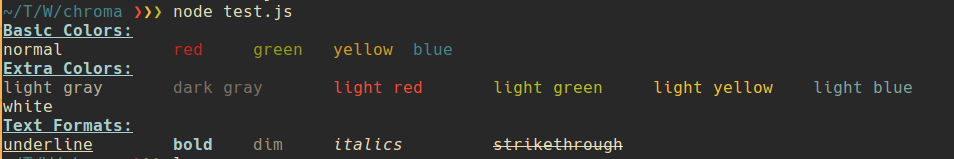

Chroma: Colors for your terminal app
---

## Intro



### Why?
I started writing more and more Node apps for the terminal and guess what? I liked them in color. So I decided I'd write a module to add colors to text for stuff that's printed to `stdout`


Yh I know there are other color packages....but this is just MINE!! 


## Install

```
npm install --save chroma
```
## Design and Usage

It can be used in the following ways:
```
chroma.<color>(string);
chroma.<format>(string);
chroma.<format>.<color>(string);
```

### Styles

#### Colors

* normal (default color)
* black
* red
* blue
* green
* yellow
* magenta
* cyan
* lgray (light gray)
* dgray (dark gray)
* lred
* lblue
* lgreen
* lyellow
* lmagenta
* lcyan
* white

#### Formats

* underline
* bold
* dim
* italics(not supported on all terminal emulators)
* strikethrough (not supported on all terminal emulators)


To use, it copy it into your project and do:
```javascript
var chroma = require("./chroma.js");
```

## Test

```bash
node test.js
```


## Some reading

[Terminal code (ANSI/VT100) introduction](http://wiki.bash-hackers.org/scripting/terminalcodes)

[Long list of codes](http://misc.flogisoft.com/bash/tip_colors_and_formatting)

* Terminal codes help you issue commands to your terminal itself.
* If the codes are understood they won't be printed but instead cause the terminal to perform an action
* Action may include changing text color or moving the cursor.
* You can use `echo` to test these codes manually.
* Escape characters are prefixed with `0x1B` or `033` in octal form. This is written as `\x1b` when using `echo`.
* The code then follows the prefix ( `\x1b[2m`  ) which is followed by whatever text stream.

```bash
echo "a\x1b[2mb\x1b[0m"
```


### Tput
* Due to varying terminal control languages you may use a tool like `tput` as an intermediary to the terminal.
* It detects the terminal and generates necessary escape codes by looking them up the `terminfo` database.
* It uses acronyms called `capability names` and parameters to do this.

```bash
echo "a$(tput dim)b$(tput sgr0)"
```

### Color codes
* Basic foreground colors start from `30m` to `39m`
* Basic background colors start from `40m` to `49m`
* Reset is `0m` and tells the terminal where to stop the effects of the previous code.
__NB: getting more colors depends on your terminal type.__

### Text formatting
* Underline is `4m` and `24m` for unsetting.
* Bold is `1m`
* Emphasis ("Italics") is `3m`
* Dim is `2m`


## TODO
- [x] Make it work more like `chroma.underline.red("Hello Word");` (Thanks to @oddoye-david)
- [x] Make an npm module.
- [ ] Add background color feature.
